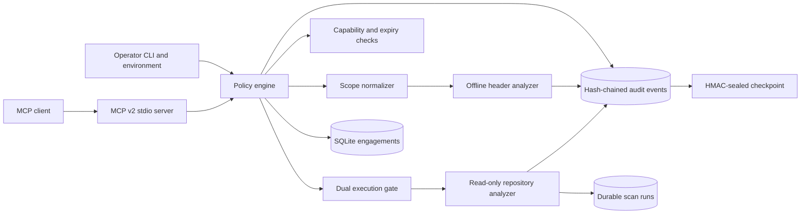

# Architecture

## Trust boundaries

1. MCP clients are untrusted callers. They may create dry-run engagements, but cannot
   create execute engagements.
2. The local operator controls execute engagements through the CLI and separately sets
   `SCOPEGUARD_EXECUTION_ENABLED=true` when starting the server.
   MCP callers cannot revoke an operator-created execute engagement.
3. Every target operation requires an active, unexpired engagement, a matching
   capability, and deterministic target-scope membership.
4. Repository paths must also be under an operator-configured allowed root. Paths are
   canonicalized before authorization and files are opened without following symlink
   components on supported POSIX platforms.
5. The server does not expose an arbitrary command, shell, Python execution, network
   request, exploit, credential, or payload tool.

## Data flow

1. The caller supplies an engagement ID, capability-specific inputs, and a target.
2. The policy engine loads immutable engagement metadata from SQLite.
3. Target normalization strips URL credentials, queries, and fragments; resolves path
   traversal; canonicalizes domains, IPs, CIDRs, and local paths; then compares scope.
4. Authorization success or failure is appended to the global audit chain.
5. Offline analysis runs only after authorization. Repository analysis additionally
   checks both execution gates, operator roots, and—when configured—a valid sealed audit
   checkpoint.
6. Results return structured data. Secret matches are replaced by keyed HMAC
   fingerprints, while file content is represented by a deterministic manifest digest.
7. The scan outcome and evidence digests are persisted before the completion event is
   appended to the audit chain.
8. The event chain is recomputed from genesis and compared with its durable checkpoint.
   When an audit key is configured, the checkpoint signature is verified in constant
   time.

## Persistence

SQLite uses WAL mode, foreign-key enforcement, and a busy timeout. Engagements and audit
events and scan runs share one database so the CLI and MCP server can safely coordinate.
Each audit event hashes canonical JSON together with the previous event hash. The event
count and chain head are stored in an HMAC-sealed checkpoint. This detects row mutation,
reordering, middle deletion, and tail truncation while the signing key remains outside the
database. Exporting the signed head to a separate append-only system provides a stronger
cross-system anchor.

## Resource model

The analyzer enforces independent ceilings for file count, per-file bytes, total bytes,
and returned findings. Header analysis has count and total-byte limits and rejects newline
characters. Engagement metadata has bounded field lengths and a bounded target count.
Truncation is explicit in results and scan evidence.

## Extension rule

New analyzers must accept structured inputs and return structured findings. They may not
accept raw shell fragments. Any future external-tool adapter must use fixed executable
argument arrays, redact output, define a capability, enforce resource limits, and add
tests for scope bypass, symlinks, timeouts, and malformed output.
