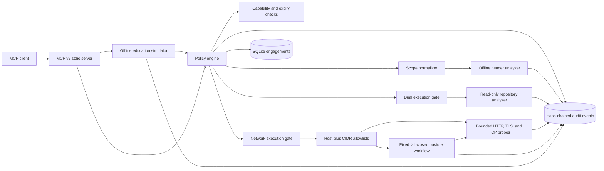

# Architecture

## Trust boundaries

1. MCP clients are untrusted callers. They may create dry-run engagements, but cannot
   create execute engagements.
2. The local operator controls execute engagements through the CLI and separately sets
   `SCOPEGUARD_EXECUTION_ENABLED=true` when starting the server.
3. Every target operation requires an active, unexpired engagement, a matching
   capability, and deterministic target-scope membership.
4. Repository paths must also be under an operator-configured allowed root. Paths and
   symlinks are resolved before the check.
5. Network probes require the execute gate, a separate network gate, exact or wildcard
   hostname approval, and approval for every resolved IP address. Connections use the
   approved address directly to reduce DNS-rebinding risk.
6. The server does not expose an arbitrary command, shell, Python execution, arbitrary
   request, exploit, credential, password-attack, or payload tool.
7. The posture workflow preflights every capability and target, resolves and authorizes one
   pinned endpoint for all steps, follows a fixed sequence, stops on the first error, and
   cannot choose follow-on techniques from results.
8. The education simulator is restricted to dry-run engagements scoped to the reserved
   `training.invalid` domain and has no runtime, filesystem, or network adapter.

## Data flow

1. The caller supplies an engagement ID, capability-specific inputs, and a target.
2. The policy engine loads immutable engagement metadata from SQLite.
3. Target normalization strips URL credentials, queries, and fragments; resolves path
   traversal; canonicalizes domains, IPs, CIDRs, and local paths; then compares scope.
4. Authorization success or failure is appended to the global audit chain.
5. Offline analysis runs only after authorization. Repository analysis additionally
   checks both execution gates and operator roots. Network probes additionally check the
   network gate and both operator allowlists.
6. Results return structured data. Secret matches are replaced by one-way fingerprints.
7. The audit chain can be recomputed from genesis to detect modified or reordered rows.

## Persistence

SQLite uses WAL mode, foreign-key enforcement, and a busy timeout. Engagements and audit
events share one database so the CLI and MCP server can safely coordinate. Each audit
event hashes canonical JSON together with the previous event hash. This detects mutation,
deletion from the middle, and reordering; it does not replace external log replication or
cryptographic signing by a separate trust domain.

## Extension rule

New analyzers must accept structured inputs and return structured findings. They may not
accept raw shell fragments. Any future external-tool adapter must use fixed executable
argument arrays, redact output, define a capability, enforce resource limits, and add
tests for scope bypass, symlinks, timeouts, and malformed output.
