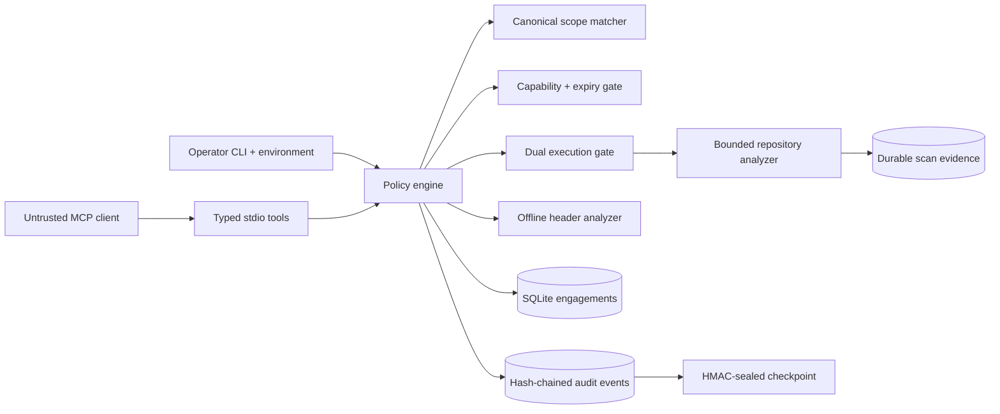

# ScopeGuard MCP

[](https://github.com/mzatylny/scopeguard-mcp/actions/workflows/ci.yml)
[](https://github.com/mzatylny/scopeguard-mcp/actions/workflows/codeql.yml)
[](https://www.python.org/)
[](https://modelcontextprotocol.io/)
[](LICENSE)

ScopeGuard is a policy-first defensive security server for MCP. It lets AI clients plan
assessments, evaluate web security headers, and scan explicitly authorized local source
trees without exposing a general shell, network scanner, exploit generator, or credential
tool.

The project demonstrates senior security-engineering concerns beyond rule detection:
authorization boundaries, canonical scope evaluation, dual execution gates, bounded
resource use, evidence integrity, secure file access, durable audit history, threat
modeling, supply-chain controls, and negative testing.

## Security guarantees

- MCP clients can create only short-lived `dry-run` engagements.
- Execute engagements are created and revoked only through the local operator CLI.
- Every target operation requires an active engagement, an explicit capability, and a
  canonical target that matches scope.
- Repository scans require both an execute engagement and the operator-controlled
  `SCOPEGUARD_EXECUTION_ENABLED` gate.
- Production execution can require an HMAC-sealed audit checkpoint. A missing or invalid
  seal fails closed.
- File traversal is bounded by file count, file size, total bytes, and finding count.
- Repository files are opened as regular files without following symlink components on
  supported POSIX platforms, reducing path-race exposure.
- Secret matches are never returned. Correlation fingerprints use keyed HMAC rather than
  a guessable unsalted digest.
- Completed scans persist a manifest digest, ruleset digest, timestamps, outcome, and
  summary so evidence can be correlated with the audit chain.
- The server uses local stdio only. It does not expose an unauthenticated network port.

These controls do not prove that a ticket represents legal authorization. The operator is
still responsible for validating permission and exporting signed audit heads to a separate
trust domain.

## Architecture



See [ARCHITECTURE.md](ARCHITECTURE.md),
[the threat model](docs/THREAT_MODEL.md), and
[the operations runbook](docs/OPERATIONS.md) for the detailed design.

## MCP tools

| Tool | Purpose | Boundary |
|---|---|---|
| `health` | Report safety posture and audit integrity | No target access |
| `create_dry_run_engagement` | Create a bounded non-executing scope | Execute mode is unavailable |
| `revoke_engagement` | Revoke an MCP-created dry-run engagement | Cannot revoke operator execute grants |
| `check_scope` | Normalize and evaluate a target | Active engagement required |
| `plan_assessment` | Produce a bounded web or repository plan | No network or process execution |
| `analyze_headers` | Inspect caller-supplied response headers | Offline and input-bounded |
| `scan_repository` | Run read-only Python and secret checks | Requires both execution gates |
| `list_audit_events` | Read engagement-specific evidence | Requires `audit:read` |
| `list_scan_runs` | Read durable scan manifests and outcomes | Requires `audit:read` |
| `verify_audit_chain` | Verify event order and the signed head | Does not reveal signing material |

## Quick start

Python 3.11 or newer is required.

```bash
python -m venv .venv
source .venv/bin/activate
python -m pip install --upgrade pip
pip install -e .

scopeguard doctor
scopeguard-mcp
```

Example MCP client configuration:

```json
{
  "mcpServers": {
    "scopeguard": {
      "command": "/absolute/path/to/scopeguard-mcp/.venv/bin/scopeguard-mcp",
      "env": {
        "SCOPEGUARD_STATE_DIR": "/absolute/path/to/scopeguard-state"
      }
    }
  }
}
```

## Authorized execution workflow

Generate and store a random audit key in your secret manager. Do not commit it or place it
in shell history. Then configure a dedicated state directory and the smallest possible
repository root:

```bash
export SCOPEGUARD_STATE_DIR=/absolute/path/to/scopeguard-state
export SCOPEGUARD_ALLOWED_ROOTS=/absolute/path/to/authorized-repositories
export SCOPEGUARD_EXECUTION_ENABLED=true
export SCOPEGUARD_REQUIRE_SEALED_AUDIT=true
export SCOPEGUARD_AUDIT_HMAC_KEY='value-loaded-from-your-secret-manager'
export SCOPEGUARD_AUDIT_KEY_ID='primary-2026'

scopeguard create-engagement \
  --title "Repository security baseline" \
  --ticket SEC-1234 \
  --target file:/absolute/path/to/authorized-repositories/example \
  --capability scan:repository \
  --capability audit:read \
  --mode execute \
  --expires-in-minutes 60

scopeguard-mcp
```

Export the signed audit head after an assessment and anchor it in an append-only external
system:

```bash
scopeguard verify-audit
scopeguard export-audit-checkpoint > scopeguard-audit-head.json
```

The checkpoint contains only the event count, chain head, key identifier, and HMAC
signature. It never includes the signing key.

## Capabilities

| Capability | Allows |
|---|---|
| `plan:assessment` | Bounded web or repository planning for an in-scope target |
| `analyze:headers` | Offline analysis of supplied HTTP headers |
| `scan:repository` | Built-in read-only scanning under both execution gates |
| `audit:read` | Engagement audit events and durable scan-run evidence |

## Configuration

| Variable | Default | Purpose |
|---|---|---|
| `SCOPEGUARD_STATE_DIR` | `<cwd>/.scopeguard` | Private SQLite state directory |
| `SCOPEGUARD_ALLOWED_ROOTS` | current directory | Path-separated operator allowlist |
| `SCOPEGUARD_EXECUTION_ENABLED` | `false` | Enables operator-created execute engagements |
| `SCOPEGUARD_REQUIRE_SEALED_AUDIT` | `true` in execute mode | Fails execution closed without a verified audit seal |
| `SCOPEGUARD_AUDIT_HMAC_KEY` | unset | At least 32 bytes; signs the durable audit checkpoint |
| `SCOPEGUARD_AUDIT_KEY_ID` | key fingerprint | Non-secret identifier used for rotation tracking |
| `SCOPEGUARD_MAX_TARGETS` | `25` | Engagement target ceiling |
| `SCOPEGUARD_MAX_HEADERS` | `100` | Offline header count ceiling |
| `SCOPEGUARD_MAX_HEADER_BYTES` | `32768` | Total header input ceiling |
| `SCOPEGUARD_MAX_FILES` | `5000` | Repository file ceiling |
| `SCOPEGUARD_MAX_FILE_BYTES` | `1000000` | Per-file read ceiling |
| `SCOPEGUARD_MAX_TOTAL_BYTES` | `50000000` | Total repository read ceiling |
| `SCOPEGUARD_MAX_FINDINGS` | `2000` | Returned finding ceiling |

## Repository analysis

The dependency-free analyzer detects focused high-signal patterns:

- Python `eval` and `exec`
- `os.system` and `os.popen`
- `subprocess` calls with `shell=True`
- unsafe Pickle deserialization
- `yaml.load` without a safe loader
- private-key blocks, AWS access keys, GitHub tokens, and likely hard-coded secrets

Results include a deterministic file-manifest SHA-256 and ruleset SHA-256. Secret values
are excluded from results, audit events, and scan records. This scanner is a bounded
baseline, not a replacement for CodeQL, Semgrep, Gitleaks, dependency auditing, or expert
review.

## Engineering quality

The repository includes:

- Python 3.11–3.13 tests with a 90% coverage floor
- Ruff lint and format verification
- static type analysis with complete function signatures
- Bandit and dependency vulnerability scanning
- CodeQL analysis on pushes, pull requests, and a weekly schedule
- package build and metadata verification
- tagged release artifacts with an SBOM and GitHub build-provenance attestation
- Dependabot for Python and GitHub Actions dependencies
- architecture, threat-model, ADR, operations, contribution, and security documents

Local verification:

```bash
pip install -e ".[dev]"
ruff check .
ruff format --check .
mypy src/scopeguard_mcp
bandit -q -r src
pytest
python -m build
twine check dist/*
```

## Responsible use

Use ScopeGuard only on repositories and systems you own or are explicitly authorized to
assess. The project intentionally excludes exploit generation, password attacks,
credential collection, payload generation, persistence, evasion, denial of service,
internet-scale scanning, and autonomous attack chains.
